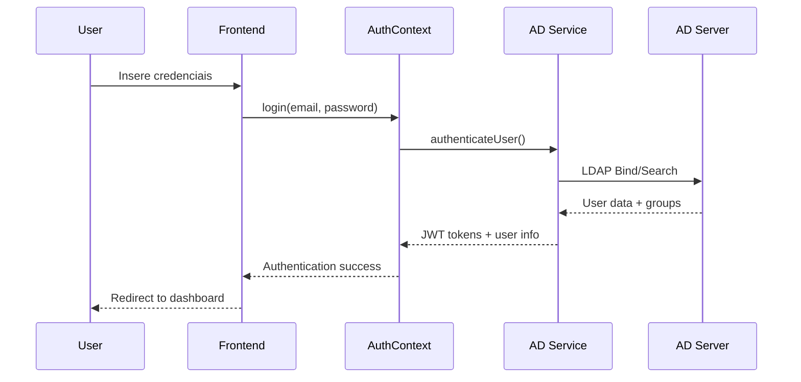

# Integração Active Directory
## Documentação Técnica Detalhada

### 📋 Índice
1. [Visão Geral](#visão-geral)
2. [Arquitetura](#arquitetura)
3. [Implementação](#implementação)
4. [Configuração](#configuração)
5. [Fluxos de Autenticação](#fluxos-de-autenticação)
6. [Segurança](#segurança)
7. [Troubleshooting](#troubleshooting)
8. [Testes](#testes)

---

## 🎯 Visão Geral

A integração com Active Directory da PGE-SC fornece autenticação centralizada e gerenciamento de permissões baseado em grupos para a plataforma institucional.

### Objetivos
- ✅ Autenticação única (SSO) com credenciais institucionais
- ✅ Gerenciamento de permissões baseado em grupos AD
- ✅ Sincronização automática de dados de usuário
- ✅ Tokens JWT seguros com auto-refresh
- ✅ Fallback para modo de desenvolvimento

### Benefícios
- **Segurança**: Autenticação centralizada e validada
- **Usabilidade**: Login único para todos os sistemas
- **Administração**: Gestão de usuários via AD existente
- **Auditoria**: Logs centralizados de acesso

---

## 🏗️ Arquitetura

### Componentes Principais

```typescript
┌─────────────────────┐
│   React Frontend    │
├─────────────────────┤
│   AuthContext      │ ← Estado global de autenticação
│   AuthProvider     │ ← Provedor de contexto
├─────────────────────┤
│ ActiveDirectoryService │ ← Serviço de integração AD
├─────────────────────┤
│ Environment Config  │ ← Configurações centralizadas
└─────────────────────┘
         │
         ▼
┌─────────────────────┐
│  Active Directory   │
│    PGE-SC Domain    │
│  ldaps://ad.pge...  │
└─────────────────────┘
```

### Fluxo de Dados



---

## 💻 Implementação

### 1. ActiveDirectoryService

O serviço principal para comunicação com AD:

```typescript
// services/ActiveDirectoryService.ts
class ActiveDirectoryService {
  // Configuração centralizada
  private config = environmentConfig.activeDirectory;
  
  // Estado interno
  private isInitialized: boolean = false;
  private authToken: string | null = null;
  
  // Métodos principais
  async initialize(): Promise<boolean>
  async authenticateUser(email: string, password: string): Promise<ADAuthResponse>
  async validateToken(token: string): Promise<boolean>
  async refreshAccessToken(refreshToken: string): Promise<ADAuthResponse>
  async getUserGroups(email: string): Promise<string[]>
  async isUserAdmin(email: string): Promise<boolean>
}
```

### 2. AuthContext

Contexto React para estado global de autenticação:

```typescript
// contexts/AuthContext.tsx
interface AuthContextType {
  // Estado
  isAuthenticated: boolean;
  isLoading: boolean;
  user: ADUser | null;
  token: string | null;
  error: string | null;
  
  // Ações
  login: (email: string, password: string) => Promise<boolean>;
  logout: () => Promise<void>;
  refreshAuth: () => Promise<boolean>;
  isAdmin: () => boolean;
  hasPermission: (group: string) => boolean;
}
```

### 3. Tipos TypeScript

Interfaces para dados do AD:

```typescript
export interface ADUser {
  id: string;
  email: string;
  displayName: string;
  firstName: string;
  lastName: string;
  department: string;
  title: string;
  phone?: string;
  groups: string[];
  isActive: boolean;
  lastLogin?: Date;
  createdAt: Date;
  updatedAt: Date;
}

export interface ADAuthResponse {
  success: boolean;
  user?: ADUser;
  token?: string;
  refreshToken?: string;
  expiresAt?: Date;
  error?: string;
  errorCode?: string;
}
```

---

## ⚙️ Configuração

### Variáveis de Ambiente

#### Desenvolvimento
```env
# Desabilitar AD em desenvolvimento
REACT_APP_AD_ENABLED=false
REACT_APP_MOCK_AUTH=true
REACT_APP_DEBUG=true
```

#### Produção
```env
# Habilitar AD em produção
REACT_APP_AD_ENABLED=true
REACT_APP_AD_DOMAIN=pge.sc.gov.br
REACT_APP_AD_SERVER_URL=ldaps://ad.pge.sc.gov.br:636
REACT_APP_AD_BASE_DN=DC=pge,DC=sc,DC=gov,DC=br
REACT_APP_AD_USER_GROUP=CN=PGE_Users,OU=Groups,DC=pge,DC=sc,DC=gov,DC=br
REACT_APP_AD_ADMIN_GROUP=CN=PGE_Admins,OU=Groups,DC=pge,DC=sc,DC=gov,DC=br
REACT_APP_AD_SSL_ENABLED=true
REACT_APP_AD_TIMEOUT=5000
```

### Configuração Centralizada

```typescript
// config/environment.ts
export const config = {
  activeDirectory: {
    enabled: getEnvVar('REACT_APP_AD_ENABLED') === 'true',
    domain: getEnvVar('REACT_APP_AD_DOMAIN', 'pge.sc.gov.br'),
    serverUrl: getEnvVar('REACT_APP_AD_SERVER_URL'),
    baseDN: getEnvVar('REACT_APP_AD_BASE_DN'),
    userGroupDN: getEnvVar('REACT_APP_AD_USER_GROUP'),
    adminGroupDN: getEnvVar('REACT_APP_AD_ADMIN_GROUP'),
    sslEnabled: getEnvVar('REACT_APP_AD_SSL_ENABLED') !== 'false',
    timeout: parseInt(getEnvVar('REACT_APP_AD_TIMEOUT', '5000'))
  }
};
```

---

## 🔄 Fluxos de Autenticação

### 1. Login Inicial

```typescript
const handleLogin = async (email: string, password: string) => {
  // 1. Validar formato do email
  if (!isValidPGEEmail(email)) {
    return { success: false, error: 'Email inválido' };
  }
  
  // 2. Autenticar via AD
  const response = await adService.authenticateUser(email, password);
  
  // 3. Processar resposta
  if (response.success) {
    // Salvar tokens e dados do usuário
    updateAuthState(response);
    saveAuthToStorage(response);
    return true;
  }
  
  return false;
};
```

### 2. Verificação de Sessão

```typescript
const checkExistingSession = async () => {
  // 1. Buscar tokens salvos
  const savedToken = localStorage.getItem('pge-auth-token');
  const savedUser = localStorage.getItem('pge-user');
  
  // 2. Validar tokens
  if (savedToken && savedUser) {
    const isValid = await adService.validateToken(savedToken);
    
    if (isValid) {
      // Restaurar sessão
      restoreSession(savedToken, savedUser);
    } else {
      // Tentar renovar token
      await refreshAuth();
    }
  }
};
```

### 3. Auto-refresh de Token

```typescript
useEffect(() => {
  if (authState.token && authState.expiresAt) {
    const timeUntilExpiry = authState.expiresAt.getTime() - Date.now();
    const refreshTime = timeUntilExpiry - 5 * 60 * 1000; // 5 min antes
    
    if (refreshTime > 0) {
      const refreshTimeout = setTimeout(() => {
        refreshAuth();
      }, refreshTime);
      
      return () => clearTimeout(refreshTimeout);
    }
  }
}, [authState.token, authState.expiresAt]);
```

### 4. Logout

```typescript
const logout = async () => {
  // 1. Limpar tokens no serviço
  await adService.logout();
  
  // 2. Limpar localStorage
  clearStoredAuth();
  
  // 3. Resetar estado
  setAuthState(initialState);
};
```

---

## 🔒 Segurança

### Proteção de Dados
- ✅ **Tokens JWT**: Não armazenamento de senhas
- ✅ **HTTPS/SSL**: Comunicação criptografada
- ✅ **Expiração**: Tokens com tempo limitado
- ✅ **Refresh**: Renovação automática de tokens
- ✅ **Validação**: Verificação contínua de autenticidade

### Controle de Acesso
- ✅ **Grupos AD**: Permissões baseadas em membership
- ✅ **Domínio**: Validação de email institucional
- ✅ **Sessão**: Cleanup automático no logout
- ✅ **Auditoria**: Logs de acesso e operações

### Configurações de Segurança

```typescript
export const securityConfig = {
  passwordMinLength: 6,
  tokenExpirationHours: 8,
  refreshTokenExpirationDays: 30,
  loginAttemptsLimit: 5,
  lockoutDurationMinutes: 15,
  requireEmailDomain: ['pge.sc.gov.br']
};
```

---

## 🔍 Troubleshooting

### Problemas Comuns

#### 1. Erro de Conexão AD
```
Erro: "Conexão com AD falhou"
```

**Diagnóstico**:
```bash
# Testar conectividade
nslookup ad.pge.sc.gov.br
telnet ad.pge.sc.gov.br 636

# Verificar certificados
openssl s_client -connect ad.pge.sc.gov.br:636
```

**Soluções**:
- Verificar configuração de rede
- Validar certificados SSL
- Confirmar URLs e portas
- Verificar firewall corporativo

#### 2. Usuário Não Encontrado
```
Erro: "Usuário não encontrado no AD"
```

**Diagnóstico**:
- Verificar se usuário existe no AD
- Confirmar grupos de usuário
- Validar DN base correto

**Soluções**:
```env
# Verificar configurações
REACT_APP_AD_BASE_DN=DC=pge,DC=sc,DC=gov,DC=br
REACT_APP_AD_USER_GROUP=CN=PGE_Users,OU=Groups,DC=pge,DC=sc,DC=gov,DC=br
```

#### 3. Problemas de Permissão
```
Erro: "Acesso negado"
```

**Diagnóstico**:
- Verificar membership em grupos
- Confirmar configuração de grupos admin
- Validar hierarquia de OUs

#### 4. Token Inválido
```
Erro: "Token expirado ou inválido"
```

**Soluções**:
- Implementar auto-refresh
- Verificar sincronização de horário
- Validar configuração de expiração

### Debug Mode

```typescript
// Habilitar logs detalhados
REACT_APP_DEBUG=true

// Console logs disponíveis
console.log('🔧 AD Config:', config.activeDirectory);
console.log('🔑 Token State:', authState);
console.log('👤 User Groups:', user.groups);
```

---

## 🧪 Testes

### Testes de Unidade

```typescript
// Testar serviço AD
describe('ActiveDirectoryService', () => {
  test('deve autenticar usuário válido', async () => {
    const response = await adService.authenticateUser(
      'joao.silva@pge.sc.gov.br', 
      'senha123'
    );
    expect(response.success).toBe(true);
  });
  
  test('deve rejeitar email inválido', async () => {
    const response = await adService.authenticateUser(
      'usuario@gmail.com', 
      'senha123'
    );
    expect(response.success).toBe(false);
    expect(response.errorCode).toBe('INVALID_DOMAIN');
  });
});
```

### Testes de Integração

```typescript
// Testar fluxo completo de autenticação
describe('Auth Flow', () => {
  test('deve fazer login e manter sessão', async () => {
    // Login
    const loginSuccess = await login('user@pge.sc.gov.br', 'password');
    expect(loginSuccess).toBe(true);
    
    // Verificar estado
    expect(isAuthenticated).toBe(true);
    expect(user).toBeDefined();
    
    // Verificar persistência
    const savedUser = localStorage.getItem('pge-user');
    expect(savedUser).toBeDefined();
  });
});
```

### Testes E2E

```typescript
// Cypress - testar interface completa
describe('Login Flow', () => {
  it('deve fazer login com usuário válido', () => {
    cy.visit('/');
    cy.get('[data-testid=email-input]').type('carlos.admin@pge.sc.gov.br');
    cy.get('[data-testid=password-input]').type('senha123');
    cy.get('[data-testid=login-button]').click();
    cy.url().should('not.include', '/login');
    cy.get('[data-testid=dashboard]').should('be.visible');
  });
});
```

---

## 📈 Monitoramento

### Métricas de Autenticação

```typescript
// Logs de auditoria
const auditLog = {
  timestamp: new Date(),
  event: 'USER_LOGIN',
  userId: user.id,
  email: user.email,
  groups: user.groups,
  success: true,
  clientInfo: navigator.userAgent
};
```

### Dashboard de Segurança

- 📊 **Logins por dia**: Gráfico de acessos
- 🚨 **Tentativas falhadas**: Monitoramento de ataques
- 👥 **Usuários ativos**: Lista de sessões ativas
- 🔄 **Renovações de token**: Frequência de refresh
- ⏱️ **Tempo de sessão**: Duração média das sessões

---

## 🔮 Roadmap

### v1.2.0
- [ ] **SSO Completo**: Integração com SAML/OAuth
- [ ] **Multi-domínio**: Suporte a múltiplos domínios
- [ ] **Auditoria Avançada**: Logs detalhados
- [ ] **Dashboard Admin**: Interface de monitoramento

### v1.3.0
- [ ] **2FA**: Autenticação de dois fatores
- [ ] **Políticas de Senha**: Configuração avançada
- [ ] **Sessões Concorrentes**: Controle de múltiplas sessões
- [ ] **API Gateway**: Proxy para outros sistemas

---

**Última atualização**: 05/09/2025  
**Versão da documentação**: 1.1.0  
**Autor**: Equipe de Desenvolvimento PGE-SC