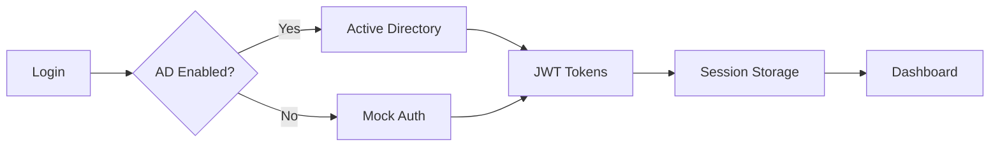

# PGE - Plataforma Institucional

> Hub de ferramentas digitais da Procuradoria-Geral do Estado de Santa Catarina

[](https://github.com/pge-sc/plataforma)
[](https://reactjs.org/)
[](https://www.typescriptlang.org/)
[](https://tailwindcss.com/)
[](LICENSE)

## 📋 Sobre o Projeto

A **PGE - Plataforma** é um sistema web moderno e responsivo que centraliza o acesso às ferramentas digitais da Procuradoria-Geral do Estado de Santa Catarina. Desenvolvida com tecnologias de ponta, oferece uma interface intuitiva e segura para advogados, servidores e colaboradores da instituição.

### ✨ Características Principais

- 🔐 **Autenticação Active Directory** - Integração com AD institucional
- 🎨 **Interface Moderna** - Design responsivo com temas claro/escuro
- 🛠️ **Hub de Ferramentas** - Acesso centralizado a diversas aplicações
- 📱 **Responsivo** - Funciona perfeitamente em desktop, tablet e mobile
- ⚡ **Performance** - Carregamento rápido e otimizado
- 🔒 **Seguro** - Controle de acesso baseado em grupos e permissões

## 🚀 Início Rápido

### Pré-requisitos

- **Node.js** 18.0.0 ou superior
- **npm** 8.0.0 ou superior
- **Git** para versionamento

### Instalação

```bash
# Clone o repositório
git clone https://github.com/pge-sc/plataforma.git
cd plataforma

# Instale as dependências
npm install

# Configure o ambiente
cp .env.example .env

# Execute em modo desenvolvimento
npm start
```

A aplicação estará disponível em `http://localhost:3000`

### 🎯 Login de Desenvolvimento

Para testar a aplicação, use qualquer um dos usuários abaixo:

| Usuário | Email | Perfil | Área Administrativa |
|---------|-------|--------|-------------------|
| Carlos Admin | carlos.admin@pge.sc.gov.br | Administrador | ✅ Sim |
| João Silva | joao.silva@pge.sc.gov.br | Procurador | ❌ Não |
| Maria Santos | maria.santos@pge.sc.gov.br | Assessora | ❌ Não |
| Pedro Oliveira | pedro.oliveira@pge.sc.gov.br | Analista | ❌ Não |
| Ana Costa | ana.costa@pge.sc.gov.br | Servidora | ❌ Não |

**Senha**: Qualquer senha com 6+ caracteres

## 🛠️ Tecnologias

### Core
- **React 18** - Framework principal
- **TypeScript** - Tipagem estática
- **Tailwind CSS v4** - Framework de estilização
- **Context API** - Gerenciamento de estado

### Funcionalidades
- **Active Directory Integration** - Autenticação empresarial
- **JWT Tokens** - Autenticação segura
- **LocalStorage** - Persistência de sessão
- **ShadCN/UI** - Componentes de interface

### Ferramentas
- **Lucide React** - Biblioteca de ícones
- **ESLint** - Qualidade de código
- **Prettier** - Formatação automática

## 🏗️ Arquitetura

```
src/
├── components/          # Componentes React
│   ├── tools/          # Ferramentas específicas
│   └── ui/             # Componentes base (ShadCN)
├── contexts/           # Contextos de estado global
├── services/           # Serviços (AD, API)
├── config/            # Configurações
└── styles/            # Estilos globais
```

### Fluxo de Autenticação



## 🔧 Configuração

### Variáveis de Ambiente

Copie `.env.example` para `.env` e configure conforme necessário:

```env
# Desenvolvimento
REACT_APP_AD_ENABLED=false
REACT_APP_MOCK_AUTH=true
REACT_APP_DEBUG=true

# Produção
REACT_APP_AD_ENABLED=true
REACT_APP_AD_DOMAIN=pge.sc.gov.br
REACT_APP_SSO_ENABLED=true
```

### Active Directory

Para ambiente de produção, configure:

```env
REACT_APP_AD_SERVER_URL=ldaps://ad.pge.sc.gov.br:636
REACT_APP_AD_BASE_DN=DC=pge,DC=sc,DC=gov,DC=br
REACT_APP_AD_USER_GROUP=CN=PGE_Users,OU=Groups,DC=pge,DC=sc,DC=gov,DC=br
REACT_APP_AD_ADMIN_GROUP=CN=PGE_Admins,OU=Groups,DC=pge,DC=sc,DC=gov,DC=br
```

## 📦 Scripts Disponíveis

```bash
# Desenvolvimento
npm start                 # Servidor de desenvolvimento
npm run dev              # Alias para start

# Build
npm run build            # Build de produção
npm run preview          # Preview do build

# Qualidade
npm run lint             # ESLint
npm run lint:fix         # Corrigir erros ESLint
npm run type-check       # Verificação TypeScript

# Testes
npm test                 # Executar testes
npm run test:coverage    # Cobertura de testes

# Utilitários
npm run clean            # Limpar arquivos temporários
npm run analyze          # Analisar bundle
```

## 🔒 Segurança

### Autenticação
- ✅ Integração com Active Directory institucional
- ✅ Tokens JWT com expiração automática
- ✅ Auto-refresh de tokens
- ✅ Validação de domínio obrigatório (@pge.sc.gov.br)

### Autorização
- ✅ Controle baseado em grupos AD
- ✅ Permissões específicas por ferramenta
- ✅ Área administrativa restrita

### Dados
- ✅ Não armazenamento de senhas no frontend
- ✅ Sessão segura com cleanup automático
- ✅ Validação de entrada rigorosa

## 🛠️ Ferramentas Disponíveis

### ✅ Implementadas
- **Miner** - Mineração de dados jurídicos
- **IA PGE** - Assistente de inteligência artificial
- **Documentos** - Repositório de documentos
- **Gestão de Usuários** - Administração (Admin)
- **Perfil de Usuário** - Configurações pessoais

### 🔄 Em Desenvolvimento
- **Pautas** - Gerenciamento de agenda
- **Relatórios** - Dashboard de indicadores
- **Base de Dados** - Acesso a bases jurídicas
- **Jurisprudência** - Consulta de precedentes
- **Biblioteca Digital** - Acervo digital
- **Comunicação** - Sistema interno
- **Configurações** - Configurações do sistema
- **Segurança** - Monitoramento e auditoria

## 📊 Status do Projeto

### Versão Atual: 1.1.0

- ✅ **Autenticação AD** - Integração completa
- ✅ **Interface Base** - Design system implementado
- ✅ **Ferramentas Core** - 5 ferramentas funcionais
- ✅ **Responsividade** - Mobile, tablet e desktop
- ✅ **Temas** - Modo claro e escuro
- 🔄 **Testes** - Em implementação
- 🔄 **Deploy** - Configuração em andamento

## 📚 Documentação

- 📖 [Documentação Técnica Completa](docs/PROJECT_DOCUMENTATION.md)
- 🚀 [Guia de Instalação](docs/INSTALLATION_GUIDE.md)
- 📝 [Changelog](docs/CHANGELOG.md)
- 🔧 [Guidelines de Desenvolvimento](guidelines/Guidelines.md)

## 🤝 Contribuição

### Padrões de Código

```typescript
// Componentes React
export const ComponentName: React.FC<Props> = ({ prop1, prop2 }) => {
  // Implementação
};

// Custom Hooks
export const useCustomHook = () => {
  // Implementação
};

// Tipos TypeScript
export interface ComponentProps {
  title: string;
  isVisible: boolean;
}
```

### Commits

Seguimos o padrão [Conventional Commits](https://www.conventionalcommits.org/):

```bash
feat: nova funcionalidade
fix: correção de bug
docs: atualização de documentação
style: mudanças de estilo
refactor: refatoração de código
test: adição de testes
```

## 🚀 Deploy

### Docker

```bash
# Build da imagem
docker build -t pge-plataforma .

# Executar container
docker run -d -p 80:80 pge-plataforma
```

### Build Manual

```bash
# Criar build otimizado
npm run build

# Servir arquivos estáticos
npx serve -s build
```

## 📞 Suporte

### Contatos
- **Email**: desenvolvimento@pge.sc.gov.br
- **Teams**: Canal #pge-plataforma
- **Telefone**: +55 48 3221-0000

### Issues Comuns
- [Problemas de Autenticação AD](docs/INSTALLATION_GUIDE.md#troubleshooting)
- [Erros de Build](docs/INSTALLATION_GUIDE.md#problemas-de-build)
- [Configuração de Ambiente](docs/INSTALLATION_GUIDE.md#configuração)

## 📄 Licença

Este projeto é propriedade da Procuradoria-Geral do Estado de Santa Catarina. Todos os direitos reservados.

**Uso Interno** - Destinado exclusivamente para uso interno da PGE-SC e entidades autorizadas.

---

## 🌟 Roadmap

### v1.2.0 - Q4 2025
- [ ] SSO completo
- [ ] Audit logging
- [ ] Performance monitoring
- [ ] PWA support

### v1.3.0 - Q1 2026
- [ ] Ferramentas avançadas
- [ ] Analytics dashboard
- [ ] Mobile app
- [ ] Integração com sistemas legados

### v2.0.0 - Q2 2026
- [ ] Microserviços
- [ ] Real-time collaboration
- [ ] IA avançada
- [ ] Enterprise security

---

<div align="center">

**Desenvolvido com pela equipe EPPE da PGE-SC**

[](https://www.pge.sc.gov.br)

</div>